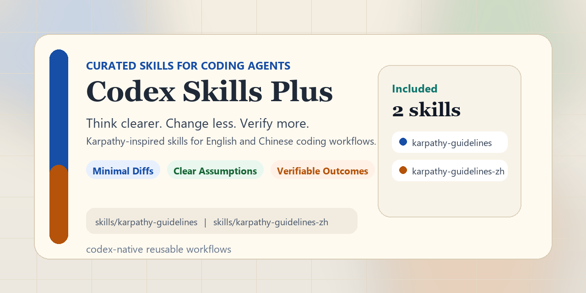

# Codex Skills Plus

English | [简体中文](./README.zh.md)

[](./skills)
[](./LICENSE)

Curated Codex skills for more reliable coding workflows. This repository packages reusable skill folders that help coding agents think more clearly, change less, and verify more.



## Quick Start

- Browse skills: [skills/index.md](./skills/index.md)
- Install by copying a skill folder into `$CODEX_HOME/skills/`
- Start with `karpathy-guidelines` for English workflows
- Start with `karpathy-guidelines-zh` for Chinese workflows
- Use [CLAUDE.md](./CLAUDE.md) or [CURSOR.md](./CURSOR.md) for root-instruction integrations
- Contribute new skills with [CONTRIBUTING.md](./CONTRIBUTING.md)

## Highlights

- Ready-to-use Codex skill folders
- Focus on practical coding workflows
- English and Chinese documentation
- Lightweight skill bodies with on-demand references
- Browseable skill catalog
- Claude/Cursor compatibility files copied from the upstream layout
- Repository preview assets for GitHub sharing

## Included Skills

### `karpathy-guidelines`

Path: [skills/karpathy-guidelines](./skills/karpathy-guidelines)

An English-first behavioral guardrail for coding tasks. Use it when the agent should:

- surface assumptions before implementing
- choose the simplest viable solution
- keep diffs narrow and directly tied to the request
- define success in testable, verifiable terms

Best for:

- implementation planning
- code review
- bug fixing
- refactoring
- debugging
- non-trivial changes where minimal, surgical edits matter

Example:

```text
Use $karpathy-guidelines to fix this bug with the smallest safe change.
```

### `karpathy-guidelines-zh`

Path: [skills/karpathy-guidelines-zh](./skills/karpathy-guidelines-zh)

A Chinese-first version of the same working style, designed for Chinese prompts and Chinese discussion during planning, review, and implementation.

Best for:

- 中文代码审查
- 中文需求澄清
- 中文实现规划
- 中文 bug 修复
- 需要用中文定义验证步骤的任务

Example:

```text
使用 $karpathy-guidelines-zh 先审视这个改动方案，再开始实现。
```

See also:

- [Skill Catalog](./skills/index.md)
- [Contribution Guide](./CONTRIBUTING.md)
- [Cursor Setup](./CURSOR.md)
- [Root Claude Instructions](./CLAUDE.md)

## Why This Exists

Andrej Karpathy has pointed out several recurring problems in LLM-assisted coding:

- models silently pick an interpretation and run with it
- models overcomplicate simple tasks
- models touch adjacent code that was not part of the request
- models complete work without strong success criteria

This repository turns those observations into Codex-compatible skills that can be reused directly in agent workflows.

## Repository Structure

```text
codex_skillsplus/
├─ docs/
│  └─ assets/
│     └─ social-preview.png
├─ .claude-plugin/
│  ├─ marketplace.json
│  └─ plugin.json
├─ .cursor/
│  └─ rules/
│     └─ karpathy-guidelines.mdc
├─ skills/
│  ├─ karpathy-guidelines/
│  │  ├─ SKILL.md
│  │  ├─ agents/openai.yaml
│  │  └─ references/examples.md
│  ├─ karpathy-guidelines-zh/
│  │  ├─ SKILL.md
│  │  ├─ agents/openai.yaml
│  │  └─ references/examples.md
│  └─ index.md
├─ CLAUDE.md
├─ CONTRIBUTING.md
├─ CONTRIBUTING.zh.md
├─ CURSOR.md
├─ EXAMPLES.md
├─ README.md
├─ README.zh.md
└─ LICENSE
```

## Installation

### Option 1: Copy into your Codex skills directory

Copy any skill folder into:

```text
$CODEX_HOME/skills/
```

If `CODEX_HOME` is not set, a common fallback is:

```text
~/.codex/skills/
```

For example:

```text
~/.codex/skills/karpathy-guidelines
~/.codex/skills/karpathy-guidelines-zh
```

### Option 2: Reference the skill by repository path

If your Codex environment supports filesystem-path invocation, use:

```text
<repo>/skills/karpathy-guidelines
<repo>/skills/karpathy-guidelines-zh
```

## Choose a Skill

- Use `karpathy-guidelines` for English prompts and English-facing workflows.
- Use `karpathy-guidelines-zh` for Chinese prompts and Chinese-facing workflows.
- Read `references/examples.md` only when the task needs concrete examples.

## Other Integration Files

- [CLAUDE.md](./CLAUDE.md): root instruction file for Claude-style project guidance
- [CURSOR.md](./CURSOR.md): how to use the committed Cursor rule in this repo and elsewhere
- [EXAMPLES.md](./EXAMPLES.md): repository-level example set mirroring the upstream layout
- [`.cursor/rules/karpathy-guidelines.mdc`](./.cursor/rules/karpathy-guidelines.mdc): committed Cursor project rule
- [`.claude-plugin/plugin.json`](./.claude-plugin/plugin.json): Claude plugin definition
- [`.claude-plugin/marketplace.json`](./.claude-plugin/marketplace.json): marketplace metadata

## Usage Notes

Use these skills when you want the agent to slow down slightly and produce cleaner, lower-risk changes.

The two skills share the same core mindset:

1. Think before coding.
2. Keep it simple.
3. Make surgical changes.
4. Drive toward verifiable success.

## Included References

Each skill keeps `SKILL.md` concise and stores richer examples in:

- [skills/karpathy-guidelines/references/examples.md](./skills/karpathy-guidelines/references/examples.md)
- [skills/karpathy-guidelines-zh/references/examples.md](./skills/karpathy-guidelines-zh/references/examples.md)

Load those files only when the current task needs concrete examples of:

- hidden assumptions
- overengineered implementations
- drive-by refactors
- vague versus verifiable execution plans

## Attribution

These skills are inspired by Andrej Karpathy's public observations on common LLM coding pitfalls and adapted into a Codex-native skill format for reusable agent workflows.

## Contributing

New skills are welcome. Follow [CONTRIBUTING.md](./CONTRIBUTING.md) for naming, layout, documentation, and validation expectations.

## License

MIT
